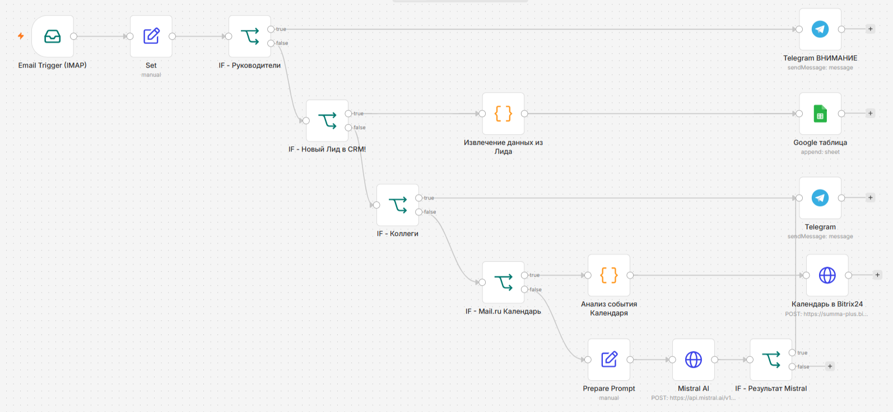

# Mail-sorter

Автоматическая классификация и маршрутизация входящей корпоративной почты VK WorkMail с помощью n8n + LLM (Mistral).

Сценарий считывает новые непрочитанные письма, нормализует данные, последовательно фильтрует их по правилам и направляет в разные действия:

- Письма от руководителей → уведомление в Telegram с пометкой «ВНИМАНИЕ»
- Письма «Новый Лид в CRM» → извлечение ID, ответственного и ссылки → запись в таблицы Google Sheets для формирования ежемесячного отчета
- Письма от коллег (сортировка по корпоративному домену) → обычное уведомление в Telegram
- Уведомления календаря Mail.ru → дублирование события в календаре Bitrix24
- Остальные письма → классификация LLM (Mistral) на spam / unknown → unknown уходит в Telegram, spam игнорируется

## Технологический стек

- n8n
- IMAP (VK WorkMail)
- Mistral AI (`mistral-small-latest`)
- Telegram Bot API
- Google Sheets API (Service Account)
- Bitrix24 REST API (calendar.event.add)
- JavaScript (Code-ноды)

## Структура воркфлоу
  → Email Trigger (IMAP)
  → Set (нормализация from / fromEmail / subject / text)
  → IF - Руководители          → Telegram ВНИМАНИЕ
  → IF - Новый Лид в CRM!      → Code (извлечение данных) → Google Sheets
  → IF - Коллеги               → Telegram 
  → IF - Mail.ru Календарь     → Code (парсинг времени) → Bitrix24 Календарь
  → Prepare Prompt
  → Mistral AI (HTTP Request)
  → IF - Результат Mistral     → Telegram (unknown) / конец (spam)

## Как запустить

1. Импортируйте файл `mail-sorter.json` в ваш экземпляр n8n.
2. Настройте credentials:
   - IMAP (VK WorkMail)
   - Telegram Bot
   - Google Service Account (для Sheets)
   - Header Auth (для Mistral API)
3. В ноде Google Sheets укажите ID вашей таблицы «Новые лиды CRM».
4. В ноде Bitrix24 вставьте URL входящего вебхука.
5. В Custom Email Rules триггера оставьте `["UNSEEN"]` и Action = Mark as Read.
6. Активируйте воркфлоу.

> Для тестирования можно временно поставить Custom Email Rules = `["ALL"]`.

## Особенности

- Гибридная логика: сначала точные правила (IF), затем LLM только для остальных, не разобранных писем.
- Безопасная очистка текста перед отправкой в LLM и мессенджеры.
- Письма от руководителей и коллег обрабатываются без LLM (экономия токенов и скорость).

