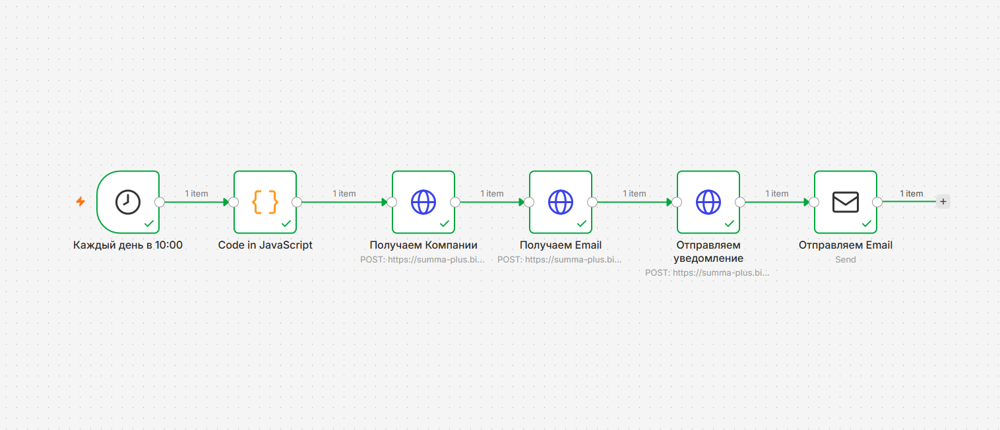

# Автоматические уведомления о графиках отгрузок действующих клиентов (n8n + Битрикс24 + Email)

### 📌 Описание кейса
Проект решает проблему отсутствия интеграции между учетной системой 1С и CRM, автоматизируя информирование менеджеров о логистике клиентов через чат CRM и корпоративную почту, без перегрузки CRM-системы.

### 🛠 Какая была проблема?
На тарифе «Стандартный» в Битрикс24 попытка настроить регулярные уведомления штатными инструментами привязывает компанию к сложной внутренней логике:
1. **Перегрузка интерфейса:** Использование стандартных роботов требует создания цепочки технических полей («Дата следующего звонка», «Сдвиг даты») и роботов-калькуляторов.
2. **Человеческий фактор:** Менеджеры вынуждены вручную контролировать даты, передвигать триггеры или закрывать просроченные задачи, что приводило к сбоям и ошибкам.
3. **Ограничения сущностей:** Работа ведется строго внутри карточек *«Компания»*, где возможности штатных роботов автоматизации более ограничены, чем в *«Сделках»*.

### 💡 Реализованное решение (Low-Code обход ограничений)
Процесс контроля дат и отправки уведомлений полностью перенесен во внешний планировщик на базе платформы **n8n**, развернутой на VPS-сервере:
1. **Минимум ввода:** Менеджер один раз отмечает галочками фиксированные дни недели в множественном поле карточки Компании.
2. **Триггер по расписанию:** Сценарий n8n (Cron) автоматически запускается каждый день -  в 10:00 утра за день до отгрузки
3. **Расчет даты:** Кастомный скрипт на JavaScript вычисляет, какой день недели будет завтра, и сопоставляет его с системными ID Битрикс24.
4. **Фильтрация и поиск:** Через метод `crm.company.list` сценарий находит компании, у которых запланирована отгрузка на завтра.
5. **Определение ответственного:** Метод `user.get` динамически запрашивает профиль менеджера из Битрикс24 по его `ASSIGNED_BY_ID`, вытаскивая актуальный корпоративный Email.
6. **Дублированное уведомление:** 
   * Метод `im.message.add` отправляет персональное сообщение в чат Битрикс24 ответственному менеджеру.
   * Узел SMTP (через сервер `smtp.mail.ru:465`) автоматически отправляет дублирующее HTML-письмо с кликабельной ссылкой на личную почту менеджера в домене VK Workmail.

### 🎯 Результат
- Менеджеры получают информацию по двум каналам одновременно: в CRM и на корпоративную почту, что исключает пропуск отгрузки.
- Ротация кадров не ломает систему: Email подтягивается динамически из профиля, жесткая привязка к именам отсутствует.
- В CRM-системе сохраняется идеальная чистота: уведомления приходят в чат и не плодят «мусорные» задачи.

### 📁 Структура проекта в репозитории
- `Shipment_notifications.json` — Обезличенный JSON-файл обновленного сценария n8n для импорта
- `Shipment_notifications_workflow.png` — Актуальный скриншот схемы рабочего процесса
- `README.md` — Описание проекта

### 📸 Схема процесса в n8n
