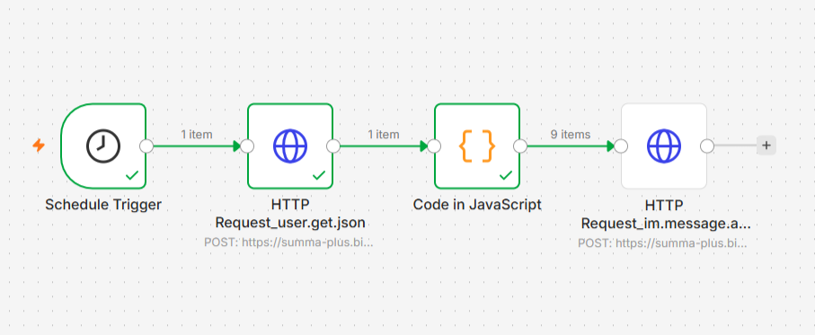

# 🛠 Status Reminders: Система ежедневных уведомлений

### 📌 Описание

Рабочий процесс настроен для автоматического ежедневного информирования сотрудников в мессенджере CRM без создания лишней нагрузки на CRM-систему. Воркфлоу по расписанию собирает актуальный список активных сотрудников из заданных отделов, преобразует массив данных и рассылает персональные push-уведомления (в колокольчик) каждому менеджеру индивидуально.

### 🛠 Какая была проблема?

На облачном тарифе «Стандартный» в Битрикс24 отсутствует штатный доступ к модулю «Бизнес-процессы», а функционал «Регулярные задачи» заблокирован. Из-за этих тарифных ограничений настроить циклическое и обезличенное ежедневное напоминание для группы сотрудников стандартными роботами CRM-маркетинга или задачами было проблематично.

### 💡 Реализованное решение

Логика циклического таймера и обработки списков полностью вынесена на сторону self-hosted сервера n8n, что позволило обойти ограничения тарифа Битрикс24 за счет использования входящих вебхуков:

1. **Запуск по расписанию:** Узел **Schedule Trigger** автоматически инициирует процесс каждый будний день в 12:00 (МСК).
2. **Динамический сбор структуры:** Узел **HTTP Request (`user.get.json`)** обращается к универсальному входящему вебхуку Битрикс24 и запрашивает список всех активных пользователей, фильтруя их по системным идентификаторам нужных подразделений (`UF_DEPARTMENT`: [VALUE]).
3. **Парсинг и преобразование массива:** Кастомный узел **Code in JavaScript** распаковывает полученный массив `result` и вытаскивает чистые `ID` пользователей. Это исключает необходимость построения циклов (Loop) в n8n.
4. **Массовая персонализированная рассылка:** Узел **HTTP Request (`im.message.add.json`)** подхватывает поток элементов и благодаря встроенной логике n8n автоматически выполняет отправку POST-запросов для каждого менеджера. Сообщения доставляются от имени системы (`"SYSTEM": "Y"`), не засоряя историю личных диалогов.

### 🎯 Результат

- **Обход тарифных лимитов:** Реализовано стабильное ежедневное расписание на Стандартном тарифе, где данный функционал штатно недоступен.
- **Чистота автоматизации:** Решение работает полностью в фоне, не создает «мусорных» технических задач в Битрикс24 и не требует ручного закрытия со стороны администратора.
- **Высокая масштабируемость:** Сценарий автоматически подстраивается под изменения в штате — при добавлении или удалении менеджеров внутри отделов в CRM, n8n подхватит актуальный список сотрудников без изменения кода.

### 📁 Структура проекта в репозитории

- `Status_Reminders.json` — Обезличенный JSON-файл сценария n8n для импорта в ваше рабочее пространство.
- `workflow_status_reminders.png` — Актуальный скриншот схемы рабочего процесса из интерфейса n8n.
- `README.md` — Техническое описание проекта, архитектуры и логики работы.

### 📸 Схема процесса в n8n
