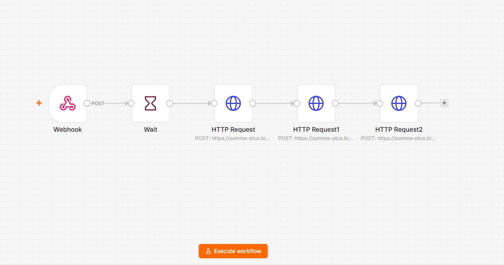

# Автоматическая привязка Контакта к Компании при закрытии Лида (n8n + Битрикс24)

### 📌 Описание кейса
Проект решает проблему изоляции сущностей CRM Битрикс24 при автоматическом создании элементов роботами на тарифах линейки «Стандартный». 

### 🛠 Какая была проблема?
На базовых тарифах Битрикс24 штатные роботы автоматизации имеют жесткие платформенные ограничения:
1. **Отсутствие сквозных ID:** Робот «Создать элемент CRM (Компания)» генерирует Компанию, но ее ID невозможно передать следующему роботу в цепочке (например, в исходящий вебхук).
2. **Изолированные сущности:** Компания создается роботом без автоматической системной привязки к родительскому Лиду (`LEAD_ID` остается пустым). Стандартный поиск по ID Лида через API не возвращает результатов.
3. **Ограничения интерфейса:** Роботы оперируют только текстовыми именами контактов, а не их числовыми ID, что делает невозможным связывание сущностей штатными методами без ручного труда менеджеров.

### 💡 Реализованное решение (Low-Code обход ограничений)
Связывание сущностей было реализовано с помощью сценария автоматизации в **n8n**, развернутого на удаленном VPS-сервере:
1. **Триггер:** Вебхук из Битрикс24 передает ID закрытого Лида и текстовое Название Лида.
2. **Оптимизация времени (Wait):** Сценарий выдерживает паузу в 30 секунд для гарантированного завершения транзакций на стороне CRM.
3. **Получение данных Лида:** Узел `crm.lead.get` извлекает скрытый системный `CONTACT_ID`.
4. **Обход ограничений через Поиск:** Узел `crm.company.list` находит только что созданную Компанию по косвенному признаку — фильтрацией по полю `TITLE` (название Компании дублирует название Лида).
5. **Финальное связывание:** Узел `crm.company.contact.add` соединяет найденную Компанию и Контакт.

### 🎯 Результат
* Процесс полностью автоматизирован в фоновом режиме (24/7).
* Исключен человеческий фактор: менеджерам больше не нужно вручную связывать контакты и компании.
* Бизнес-задача решена без перехода на дорогостоящие старшие тарифы CRM-системы.

### 📁 Структура проекта в репозитории
* `n8n_workflow.json` — Обезличенный JSON-файл сценария n8n для импорта.
* `README.md` — Описание проекта.

### 📸 Схема процесса в n8n
