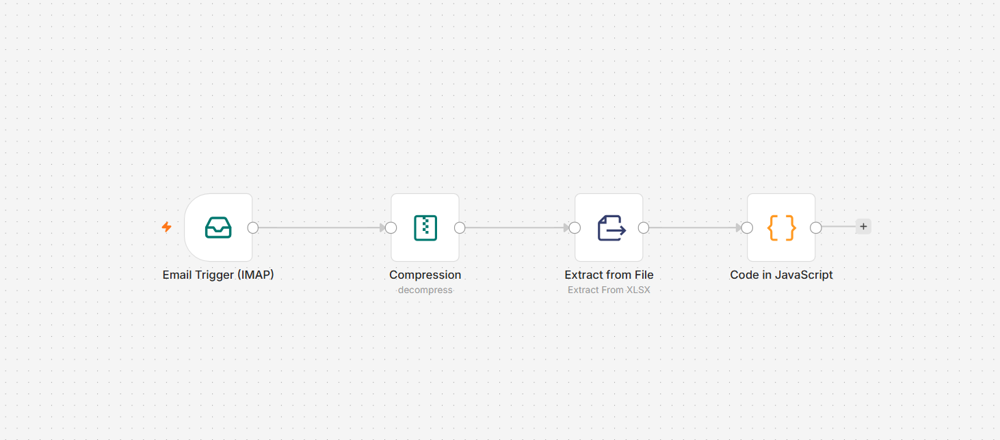
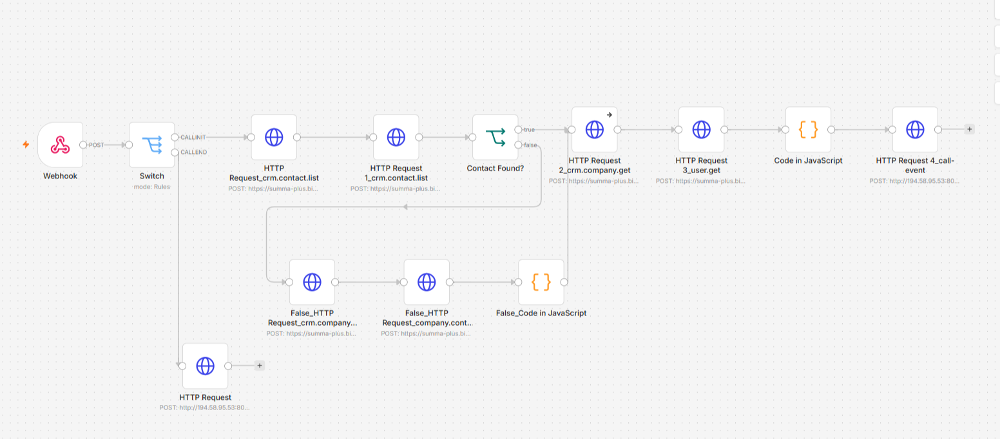
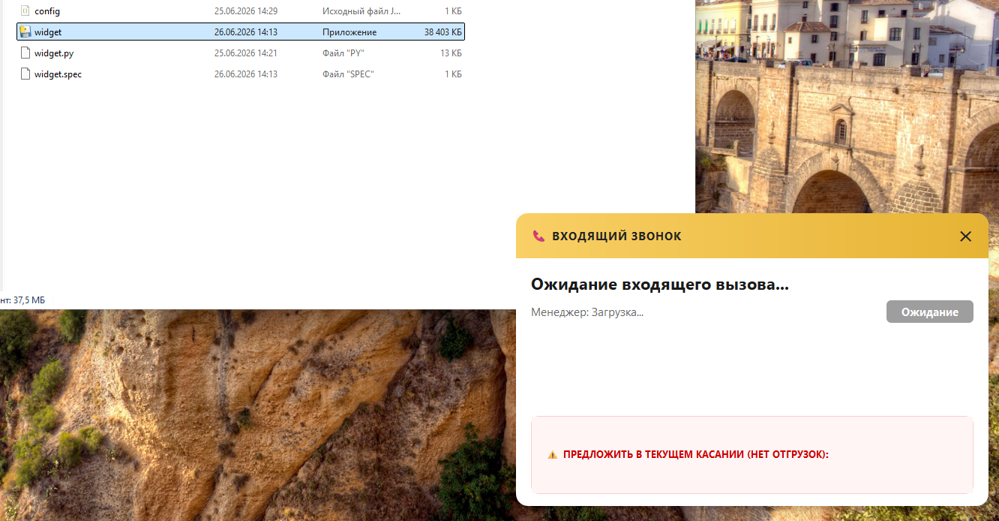

# Corporate Widget: Smart Cross-Sell

Автономный десктоп-виджет для менеджеров отдела продаж. При входящем вызове на корпоративный телефон приложение мгновенно всплывает поверх всех открытых окон (учетные системы, таблицы, браузер) ответственного сотрудника, отображая просадку ассортимента («красные ячейки») на основе автоматической аналитики данных из внутренней учетной системы (1С).

---

## Стек технологий
* **Автоматизация бизнес-логики:** n8n (VPS, Docker)
* **Транспортный узел (Event Broker):** FastAPI + WebSockets (Python 3, VPS)
* **Клиентское приложение:** Python 3 + PyQt6 (упаковано в `.exe` через PyInstaller)

---

## Архитектура проекта

```text
corporate-widget-smart-cross-sell/
├── backend/            # Серверная часть (FastAPI + WebSockets)
│   └── main.py
├── n8n/                # Сценарии автоматизации n8n
│   ├── daily_1c_sync.json    # Workflow 2: Ежедневный расчет матрицы просадок ассортимента
│   └── smart_cross_sell.json # Workflow 1: Обработка входящего вызова
├── widget/             # Клиентское приложение (PyQt6)
│   ├── config.json     # Локальный конфигурационный файл (генерируется автоматически)
│   └── widget.py       # Исходный код виджета
├── README.md           # Документация проекта
└── requirements.txt    # Зависимости для серверной и клиентской частей
```

---

## Как это работает

Вся система работает в полностью автоматическом режиме и разделена на два независимых фоновых цикла.

### 1. Ежедневный расчет матрицы просадок ассортимента
Этот процесс запускается по расписанию один раз в сутки для подготовки актуальной базы рекомендаций к началу рабочего дня.



1. **Сбор данных:** Каждое утро в 08:00 n8n подключается к почтовому серверу через IMAP-ноду и скачивает свежий архивный отчет по продажам, выгруженный из учетной системы.
2. **Распаковка и парсинг:** Специализированная нода распаковывает архивный файл, после чего встроенный парсер считывает структуру табличных данных XLSX.
3. **Аналитический расчет:** JavaScript-скрипт динамически определяет столбцы текущего и трех предыдущих месяцев для автоматического сдвига дат. Затем он очищает наименования 300 контрагентов базы от лишних символов (кавычки, формы собственности, холдинговые приставки) и вычисляет «красные ячейки» — товары, по которым были отгрузки за последние 3 месяца, но нет отгрузок в текущем месяце.
4. **Кэширование:** Готовая аналитическая матрица сохраняется в оперативную статическую память воркфлоу (`$getWorkflowStaticData`), обеспечивая мгновенный доступ к данным без повторного чтения тяжелых файлов.

### 2. Обработка входящего вызова и push-нотификация менеджера
Этот процесс срабатывает индивидуально при каждом телефонном звонке и занимает доли секунды.



1. **Перехват вызова:** При входящем звонке от клиента CRM-система мгновенно отправляет webhook на Production URL сервера n8n.
2. **Маршрутизация на ответственного:** n8n проверяет тип события из CRM. Для звонков от клиентов извлекается ID компании и сотрудник. Это гарантирует, что подсказка прилетит именно тому менеджеру из команды, который ведет данного клиента. Если номер неизвестен, воркфлоу останавливается, предотвращая ложные срабатывания.
3. **Формирование подсказки:** При старте звонка (`ONVOXIMPLANTCALLINIT`) JavaScript-нода сопоставляет имя звонящего с утренним кэшем, формирует список просевших товаров и переводит статус CRM в текст. Раскодирует числовой статус компании из базы данных CRM в понятный текстовый формат (например, «Отложен» или «Действующий»). При завершении (`ONVOXIMPLANTCALLEND`) n8n генерирует пакет отбоя `hide_widget`. 
4. **Мгновенная доставка (Push):** n8n формирует плоский JSON-пакет и шлет POST-запрос с токеном авторизации на FastAPI. Сервер валидирует Pydantic-модель данных и мгновенно пересылает пакет в открытый WebSocket-канал конкретного сотрудника.
5. **Вывод на экран:** Локальный PyQt6-клиент на компьютере менеджера перехватывает WebSocket-событие, за доли секунды отрисовывает кастомное окно поверх абсолютно всех запущенных программ и принудительно удерживает на нем фокус операционной системы Windows. Менеджер видит подсказку еще до того, как снимет трубку. При завершении — клиент ловит сигнал отбоя и автоматически скрывает виджет (`self.hide()`).

   

---

## Установка и запуск

### 1. Клонирование репозитория и подготовка окружения
```bash
git clone https://github.com
cd My-Projects/corporate-widget-smart-cross-sell
python -m venv venv
source venv/bin/activate  # Для Linux/macOS
# venv\Scripts\activate   # Для Windows
pip install -r requirements.txt
```

### 2. Импорт сценариев автоматизации n8n
Для быстрого развертывания логики ETL и вебхуков:
1. Создайте два новых пустых воркфлоу в вашем экземпляре n8n.
2. В каждом воркфлоу откройте меню настроек (три точки в верхнем правом углу) и выберите **Import from File**.
3. Загрузите файлы `daily_1c_sync.json` и `smart_cross_sell.json` из папки `n8n/`. Настройте свои учетные записи (Credentials) для почты и CRM.

### 3. Развертывание бэкенда на VPS
Перенесите папку `backend` на сервер и запустите скрипт в фоновом режиме:
```bash
cd backend
nohup python main.py &
```
* Сервер использует изолированный порт `8082`.
* Логи входящих вебхуков и подключений сокетов записываются в `backend/nohup.out`.

### 4. Сборка и деплой виджета на рабочие места
Для компиляции скрипта PyQt6 в единый исполняемый файл без консольного окна Windows выполните на рабочем ПК:
```bash
cd widget
pyinstaller --noconsole --onefile widget.py
```
Готовый исполняемый файл из папки перенесите на рабочие ноутбуки менеджеров

1. **Первый запуск:** Введите персональный ID сотрудника из CRM во всплывающем окне авторизации (значение автоматически запишется в локальный `config.json`).
2. **Автозапуск:** Нажмите сочетание клавиш `Win + R`, введите команду `shell:startup` и перетащите в открывшуюся системную папку ярлык скомпилированного файла.

