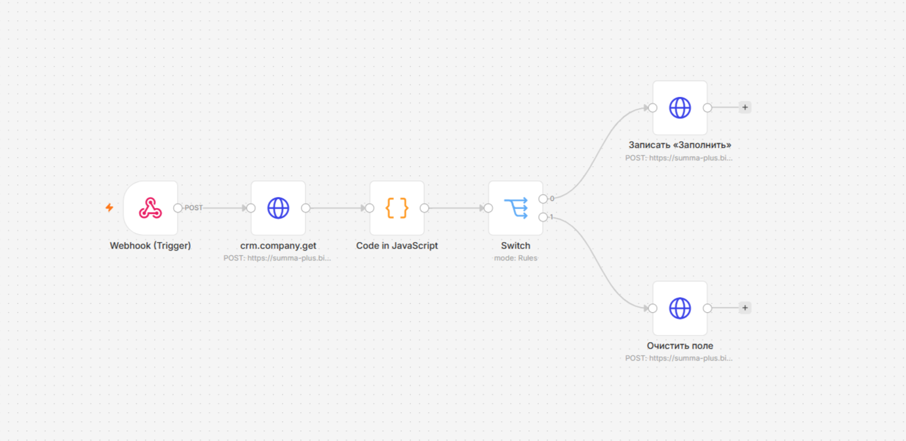

# Dependent Fields: Автоматизация зависимых полей карточки


## 📌 Описание проекта
Сценарий для автоматического управления кастомными полями в CRM на основе бизнес-логики компании. В базовом функционале CRM часто нет штатного механизма, который скрывает или принудительно очищает одни поля в зависимости от значений в других, а сторонние приложения из Маркета требуют полноценной платной подписки ради одной микро-функции (скрытия по галочке). Данное решение позволяет обойти это ограничение без дополнительных затрат.

Данное решение автоматизирует этот процесс: если в множественном поле **«Товарные группы»** выбран пункт, например, **«Твёрдые сыры»**, система автоматически выставляет признак для отображения зависимого поля **«Пармезан»**. Если галочка снимается — автоматика мгновенно очищает зависимое поле, скрывая его из карточки, чтобы не перегружать интерфейс менеджера.

---

## 🛠 Стек технологий
- **Автоматизация бизнес-логики:** n8n (VPS, Docker)
- **Язык обработки данных:** JavaScript (Node.js)
- **Протокол взаимодействия:** REST API (Исходящие вебхуки, методы GET и UPDATE)

---

## 🧱 Архитектура проекта внутри репозитория

```text
My-Projects/
└── dependent-fields/
    ├── workflow.png                     # Скриншот цепочки автоматизации n8n
    ├── dependent_fields_workflow.json  # Экспортированный сценарий воркфлоу для импорта
    └── README.md                        # Документация проекта
```

---

## ⚙️ Логика работы приложения

Сценарий работает в фоновом асинхронном режиме:

1. **Триггер**: Перехват вебхука от CRM в момент обновления карточки компании.
2. **Запрос данных**: Получение актуального состояния полей «Товарные группы» и «Пармезан».
3. **Фильтрация (JS)**: Анализ условий. Формирует команду `write` (записать значение, если выбраны значения) или `clear` (очистить поле, если значения убраны). Строго блокирует бесконечный цикл запросов (`stop`).
4. **Маршрутизация и Исполнение**: Через ноду Switch поток распределяется на соответствующий метод обновления карточки в CRM (запись признака «Заполнить» либо передача пустой строки `""` для полной очистки поля).



---

## 🚀 Как развернуть сценарий у себя

### 1. Настройка CRM
Настройте исходящий вебхук на событие обновления компании, указав в качестве адреса обработчика URL ноды-триггера из n8n.

### 2. Импорт воркфлоу в n8n
1. Создайте пустой воркфлоу в n8n, нажмите `...` в верхнем углу -> **Import from File**.
2. Загрузите файл `dependent_fields_workflow.json`.
3. В нодах запросов укажите ваш URL CRM и авторизационные данные (вебхуки/токены).
4. Активируйте воркфлоу.
